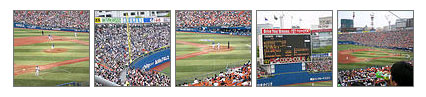

# FlickrPublicPhotosプラグイン

[Flickr](http://www.flickr.com/)のPublic Photosをリストアップするプラグイン。

Movable Type 3.2では動作しません。放置中です。

## 更新履歴

 * 0.10(2005.05.05):
   * 公開開始。
 * 0.11(2005.05.06):
   * クリーンアップ。
 * 0.12(2005.05.07):
   * 100枚以上のPublic Photoに対応。
   * Public Photoの撮影日・アップロード日・オーナーの情報を取り出せるように機能追加。
 * 0.13(2005.05.08):
   * サイズの指定方法をより直感的なものに改善したつもり。
 * 0.20(2005.05.27):
   * 高速化。
   * Flickr Serviceが落ちている場合への対策。
 * 0.21(2005.06.08):
   * バグ修正。

## 概要

FlickrのPhotosetsをリストアップするプラグインとしては下記がよく知られていますが、私の知る限り、単純にして最も有用と思われる、自分の公開している写真(Public Photos)をリストアップするプラグインはありませんでした。

[TWiki . Main . MovableTypeFlickrPhotosets](http://twiki.tensegrity.net/bin/view/Main/MovableTypeFlickrPhotosets)

FlickrPublicPhotos Pluginは、指定したユーザー(username、メールアドレス、NSIDのいずれかで指定できます)のPublic Photosをリストアップする機能を提供します。リストアップ時に最新のN件だけ、もしくはランダムに選んだN件だけを表示することもできます。

0.20以降では、Flickr APIのアクセスを抑制するために前回の取得結果をキャッシュし、一定期間内は再利用するようになっています。これにより、もし再構築時が高速化されるだけでなく、Flickr Serviceが停止している場合にもプラグインが正常に機能します。

また、0.20以降では、MTFlickrPublicPhotoImgURLの指すイメージファイルを自動的にローカルサイトにダウンロードし、MTFlickrPublicPhotoImgURLタグ自体の戻り値はローカルサイトにダウンロードしたファイルのURLを返します(この機能はデフォルトではオフです)。この機能により、Flickr Serviceが停止している場合にもthumnail表示を正常に行うことができます。また、単純にFlickrにアップロードした画像をバックアップする用途にも使えます。

## 必要なもの

Movable Typeがインストールされている必要があります。Movable Type 3.151日本語版でしか試していませんが、大抵の環境で動作すると思います。

Cal Henderson作の以下の3つのPerl Moduleがインストールされている必要があります。

 * [http://search.cpan.org/~iamcal/Flickr-API-0.03/](http://search.cpan.org/~iamcal/Flickr-API-0.03/)
 * [http://search.cpan.org/~iamcal/XML-Parser-Lite-Tree-0.03/](http://search.cpan.org/~iamcal/XML-Parser-Lite-Tree-0.03/)
 * [http://search.cpan.org/~iamcal/XML-Parser-Lite-Tree-XPath-0.02/](http://search.cpan.org/~iamcal/XML-Parser-Lite-Tree-XPath-0.02/)

## インストール方法

FlickrPublicPhotos.zipに含まれるFlickrPublicPhotos.plをプラグインディレクトリーにコピーします。

正しくインストールが完了すれば、MT3では、メインメニューの「利用可能なプラグインの設定」にFlickrPublicPhotos Pluginが表示されるはずです。

## 追加されるタグ

### MTFlickrPublicPhotosコンテナタグ

MTFlickrPublicPhotosコンテナタグでは、以下の3つのオプションを指定できます。

 * user="username" (必須): 表示したいPublic Photosのオーナーであるユーザー名、またはメールアドレス、またはそのNSIDを指定します。
 * lastn="N": 最新のN個の写真を表示します。
 * random="N": ランダムにN個の写真を選んで表示します。
 * refresh="R": Flickr APIを使って取得したPublic Photosの情報をキャッシュします。キャッシュの有効期限はR秒間。デフォルトでは3600秒間(=1時間)キャッシュを保持します。

lastn、randomオプションを省略するとすべての写真を表示します。また、lastnとrandomオプションを同時に指定するとlastnの指定は無効になります。

0.20から追加されたFlickr APIのキャッシュ機能はMovable TypeのPluginDataの機能を使っているため、Storable.pmが必須です。また、SQLite 3.XベースのDBD-SQLite-1.0Xモジュールを使用している場合も正常にキャッシュできないことが判っています(古いDBD-SQLiteやBerkeleyDB、MySQLでの動作は確認しています)。キャッシュできない(毎回アクセスに行く)というだけで機能上は問題ありません。

### MTFlickrPublicPhotoTitleタグ

写真のタイトルを表示する変数タグ。MTFlickrPublicPhotosコンテナタグの内部で利用できます。

### MTFlickrPublicPhotoURLタグ

写真のページのURLを表示する変数タグ。MTFlickrPublicPhotosコンテナタグの内部で利用できます。

#### MTFlickrPublicPhotoImgURLタグ

写真のURLを表示する変数タグ。MTFlickrPublicPhotosコンテナタグの内部で利用できます。

この変数タグには以下のオプションを指定できます。

 * size="sq|t|s|m|l|o": 表示するサイズを指定するオプション。それぞれ、Square(75x75)、Thumbnail(100x75または75x100)、Small、Medium、Large、Originalの各サイズを表します。デフォルトはsize="t" (Thumbnail)です。ちなみにsize="small", size="medium"などのように指定しても機能します。
 * cache="relative-path": イメージファイルをローカルサイトにダウンロードし、ローカルサイトのイメージファイルのURLを返します。この機能はデフォルトでオフです。''relative-path''にはダウンロードするディレクトリを「ローカル・サイト・パス」からの相対パスで指定します。
 * cache_refresh="Seconds": イメージファイルのローカルサイトへのダウンロードを抑制する時間を秒数で指定します。デフォルトでは86400秒(1日)です。

cache、cache_refreshオプションは、MTFlickrPublicPhotoImgURLの指すイメージファイルをローカルサイトにダウンロードする機能を提供します。この場合、MTFlickrPublicPhotoImgURLタグ自体の戻り値はローカルサイトにダウンロードしたファイルのURLを返します。

cacheオプションで指定する相対パスのディレクトリが存在しない場合自動的に作成します。ディレクトリが作成できない場合、ダウンロードしたファイルがディレクトリに書き込めない場合には、もともとのFlickrのURLを返します。

イメージファイルのダウンロードは、If-Modified-Sinceヘッダ付きでリクエストすることで、なるべく抑制しています。また、ファイルが作成されてから「cache_refreshオプションで指定された秒数」経過するまではリクエストしません。

(このあたりの仕様はよく煮詰めていません。リクエストしなくてもファイルにはtouchしておいた方がよいかなと。)

### MTFlickrPublicPhotoUploadDateタグ

写真のアップロード時刻を表示する変数タグ。MTFlickrPublicPhotosコンテナタグの内部で利用できます。MTDate, MTEntryDateなどと同様に日付フォーマットを指定することができます。

### MTFlickrPublicPhotoTakenDateタグ

写真の撮影時刻を表示する変数タグ。MTFlickrPublicPhotosコンテナタグの内部で利用できます。MTDate, MTEntryDateなどと同様に日付フォーマットを指定することができます。

### MTFlickrPublicPhotoOwnerNameタグ

写真の所有者を表示する変数タグ。MTFlickrPublicPhotosコンテナタグの内部で利用できます。

## 使用例

ユーザー名「Hirotaka Ogawa」さんの最新の5件のPublic PhotoをSquareサイズで表示します。

    

      <MTFlickrPublicPhotos user="Hirotaka Ogawa" lastn="5">
      <a href="<$MTFlickrPublicPhotoURL$>"
         title="<$MTFlickrPublicPhotoTitle encode_html="1"$>">
        " />
      </a>
      </MTFlickrPublicPhotos>
    

出力結果は以下のようになります。

    

      
      
      
      
      
    

ブラウザでは以下のように表示されるでしょう。

## See Also

## License

This code is released under the Artistic License. The terms of the Artistic License are described at [http://www.perl.com/language/misc/Artistic.html](http://www.perl.com/language/misc/Artistic.html).

## Author & Copyright

Copyright 2005, Hirotaka Ogawa (hirotaka.ogawa at gmail.com)
